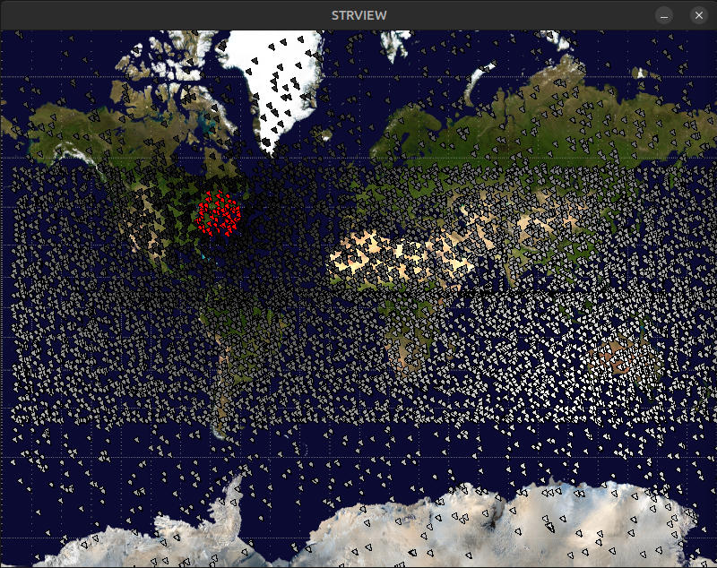
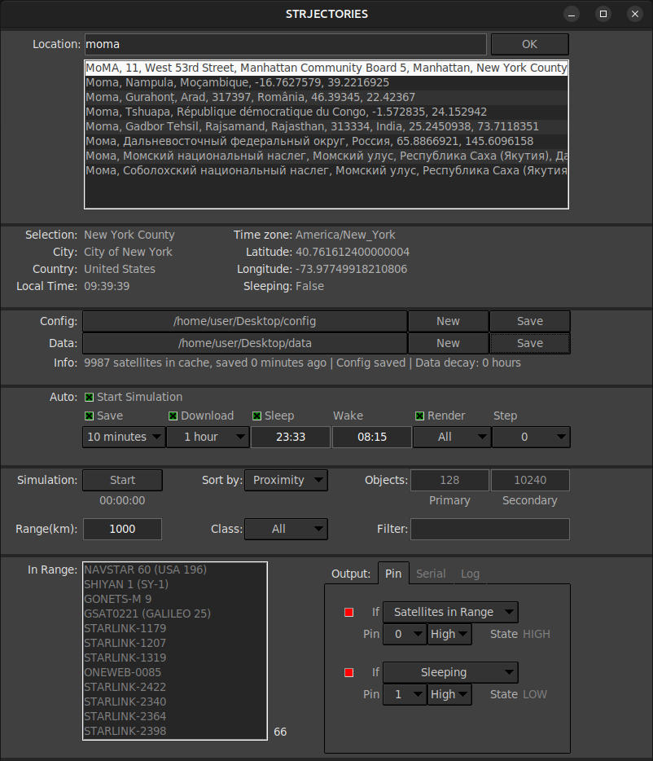
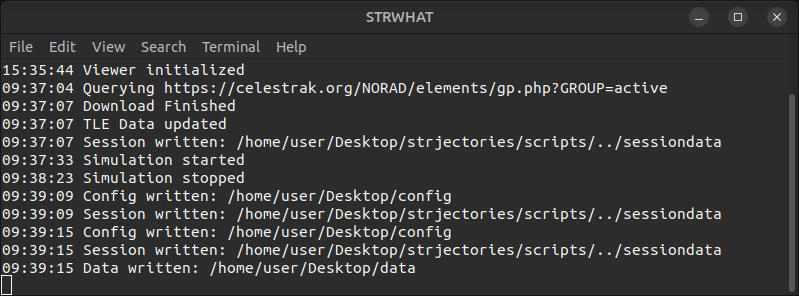

# STRJECTORIES
A satellite tracking software to monitor the sky above a given location. While it should run on most systems supporting Python3, it is designed to run on a Raspberry Pi 5 to drive a robotic artwork by artist duo <i>strwüü</i>.
 
## Installation
It is recommended to use a virtual environment.

### Debian based OS
`install`, `update` and `lauch` scripts for Debian based systems like Ubuntu or Raspbian OS are included in the repository. After downloading the repository, the scripts can be launched from command line or by double clicking the files. The scripts use `python3 -m venv venv` inside the directory. If you wish to use another or no virtual environment, see manual installation steps in <i>Other OS</i>.  
### Other OS
On other systems, dependencies need to be installed manually. Open a terminal and navigage to the strjectories folder you have just downloaded. Optionally create a virtual environment using `python3 -m venv venv`. Required step: `pip install -r requirements.txt` will install the python packages required to run strjectories. If your systems default python version is 2.x, make sure you have Python3 installed and use `pip3 install -r requirements.txt` instead. 

 

## Quickstart
### Debian based OS
After installation, you can execute `lauch` from either a terminal or by clicking on it. If you have chosen to create a desktop icon during installation, you can click that as well.
To launch the application without UI, use `launch_noui`.
### Other OS
Open a terminal, navigate to the strjectories folder and and type `python3 scripts/main.py`.
To launch the application without UI, type `python3 scripts/main.py -b`.

<b>Note:</b> As of now, headless mode (no UI) is not interactive. You should run the UI at least once to download data and set your configuration. After you have saved your config and data files, you can use headless mode and change settings by modifying the files using a text editor.   
### Run Simulation
The <i>STRJECTORIES</i> window of the UI lets you set up options for your simulation, detailed below. To run a simulation, you need enter a location and download data using the Data/New Button. Press <i>Start</i> to run the simulation.

 

## Viewer Window

A map of satellites is rendered to this window. The viewer has a simple color coding: Red satellites are in range, all other satellites are fading between black and white depending on their distance from the target location. Satellites selected in the property window are outlined yellow. 

 

## Property Window

### Location Panel
Enter an address or location in the search bar and select a result from the list. Much like using your favourite map service!

### Selection Panel
Displays additional information for the selected location and indicates if the system is sleeping.

### File Panel
Strjectories relies on two types of files, one that stores the configuration set in the UI and one to store satellite data. In the file panel you can create, open and save both file types. The files use JSON as a format. An additional line of text displays the number of active satellites, save states and the decay of the satellite data's precision.  

### Automation Panel
In this Panel you can choose, what the system does automatically and in which intervals. Options are:

+ <b>Auto Start Simulation:</b> If enabled, simulation starts upon load.

+ <b>Auto Save:</b> 
If enabled, changing a property triggers your config file being saved. Also, when simulating, newly calculated satellite data is written to disk in the interval set below.

+ <b>Auto Download:</b> 
If enabled, satellite data is updated in the interval set below. As satellite data becomes unprecise after a day or two, enable this option to keep your objects up to date.

+ <b>Auto Sleep:</b> 
If enabled, simulation is stopped between the two daytimes set below. Uses local time of selected location, 24h input.

+ <b>Auto Render:</b> 
If enabled, the viewer window gets updated with every change. Select the render range below choosing from <i>All, In Range, Primary,</i> and <i>Secondary</i>.  <b>Note: For users of systems with little resources, like the Raspberry Pi, rendering <i>all</i> is not recommended while running the simulation.</b>

+ <b>Render Step: </b> 
This option specifies, how often satellites are being rendered: while the calculation is running, the visual representation of each satellite is only updated every nth time. <b>Note: This option is usefull for users of systems with little system resources like the Raspberry Pi. Setting a render step greater than 0 can avoid GPU bottlenecks, UI freezes and crashes.</b> 

### Simulation Panel
Press <i>Start</i> to run the simulation.
Options are:
+ <b>Sort by:</b> Defines the order in that satellite are upated. Satellites can be sorted either by proximity to the selected location or by their velocity. 
+ <b>Objects:</b> Calculations are split into 2 threads to allow faster updates for prioritized (closer or faster) objects.  
+ <b>Range:</b> Defines the radius to identify satellites.
+ <b>Class:</b> Filter satellites by classification. <b>Note: There are only <i>unclassified</i> objects in the data obtained from the current source.</b>  
+ <b>Filter:</b> Filter objects by name  

### In Range Panel
Displays a list of satellites in range and their count.

### Output Panel
#### Pin Tab
<b>Note: Pin communication is only implemented for Raspberry Pi 5.</b> Strjectories can set 2 different GPIO pins depending on various options. Options for both 'slots' are the identical:
+ <b>Use: </b>Set the checkbox if you want to use this pin
+ <b>If: </b>Set the condition for setting the pin. Options are <i>(not) Sleeping</i> and <i>(no) Satellites in Range</i>. 
+ <b>Pin: </b>Raspberry Pi GPIO pin number
+ <b>Value: </b>Value to set pin to if condition is fulfilled  
+ <b>State: </b>This display shows the current state of the pin or previews it if the pin is not used

#### Serial Tab
+ <b>Use: </b>Set the checkbox if you want to use this serial port
+ <b>Port: </b>Set the serial port 
+ <b>Baud: </b>Set the serial baud rate
+ <b>Value: </b>Value to send. Options are <i>In Range Count</i> and <i>(no) Satellites in Range</i>

#### Log Tab
If <i>Log</i> is enabled and a log file is set using <i>open</i> or <i>new</i> , strjectories logs things.
The maximum number of lines to log is set in the <i>Lines max</i> input field.

Events you can log are: 
+ Engine events
+ File I/O
+ Updates (Downloads)
+ Sleep/Wake
+ (In Range) List
+ (In Range) List Length
+ Pin I/O
+ Serial I/O

## Output Window

The Ouput Window displays valuable Information: Engine events, File I/O, Downloads, Sleep/Wake. Depending on the way you have started strjectories, this info might appear in the terminal you started the program from.
